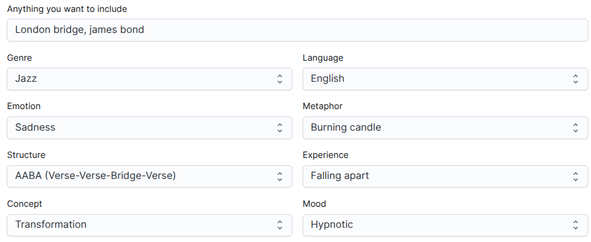

---
tags:
  - prompt
  - audio
  - lyrics
  - suno
date: "lun. 24/11/2025"
---

## Esempio d'uso di Suno (IA Generativa per suoni e canzoni)

### Generatore di prompt

- [How to prompt Suno](https://howtopromptsuno.com/)

### Lyrics



```txt
[Intro]  
(Softly now...)  
(Gently we sway...)  
(Still the echoes fade...)  
(As we recall...)  
(The light of yesterday...)  

[Verse 1]  
Underneath that London bridge, shadows intertwine,  
Whispers of a lover lost, like old smoke and wine.  
I watch a burning candle, melt away its grace,  
The flicker of memories dancing, in our once golden space.  

[Verse 2]  
You wore your heart like James Bond, a slick masquerade,  
Exuding charm, yet something deep, was slowly starting to fray.  
With every stolen glance, I felt the tides of change,  
But the flame that held us close now seems so far out of range.  

[Bridge]  
A hypnotic rhythm sighs, through the secret streets we roam,  
Where love was once a fortress built, it becomes a crumbling dome.  
And as those dreams dissolve like smoke, I hear the city's call,  
In this transformation, we must learn to let it fall.  

[Verse 3]  
So now I walk beneath the bridge, where the past plays its tune,  
A burning candle flickers low, beneath the silver moon.  
With every step, I shed the weight, of what we used to be,  
Must find a new reflection in the depths of you and me.  

[Outro]  
(Softly now...)  
(Gently we sway...)  
(Still the echoes fade...)  
(As we recall...)  
(The light of yesterday...)  
```

---

### Style Prompt 1

```txt
dreamy smooth jazz, melancholic, moderate tempo, dark female voice.
```

### Output 1

<audio preload="metadata" style="width:100%" controls="" id="audio-tag0">
  <source src="As%20we%20recall%2001.mp3" type="audio/mpeg">
</audio>

### Output 2

<audio preload="metadata" style="width:100%" controls="" id="audio-tag0">
  <source src="As%20we%20recall%2002.mp3" type="audio/mpeg">
</audio>

---

### Style Prompt 2

```txt
Dark experimental trip-hop, Bristol sound, deep dub bassline, slow syncopated breakbeats, hypnotic and claustrophobic atmosphere, glitchy textures, haunting whispery female vocals, cinematic noir string section.
```

### Output 3

<audio preload="metadata" style="width:100%" controls="" id="audio-tag0">
  <source src="As%20we%20recall%2003.mp3" type="audio/mpeg">
</audio>


---


